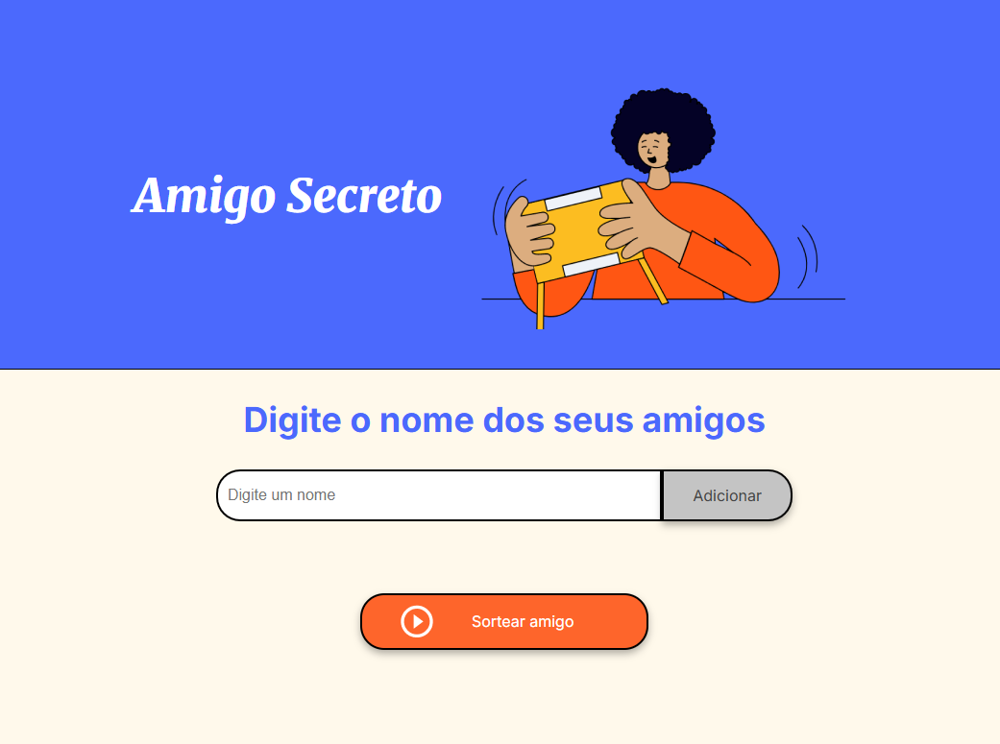
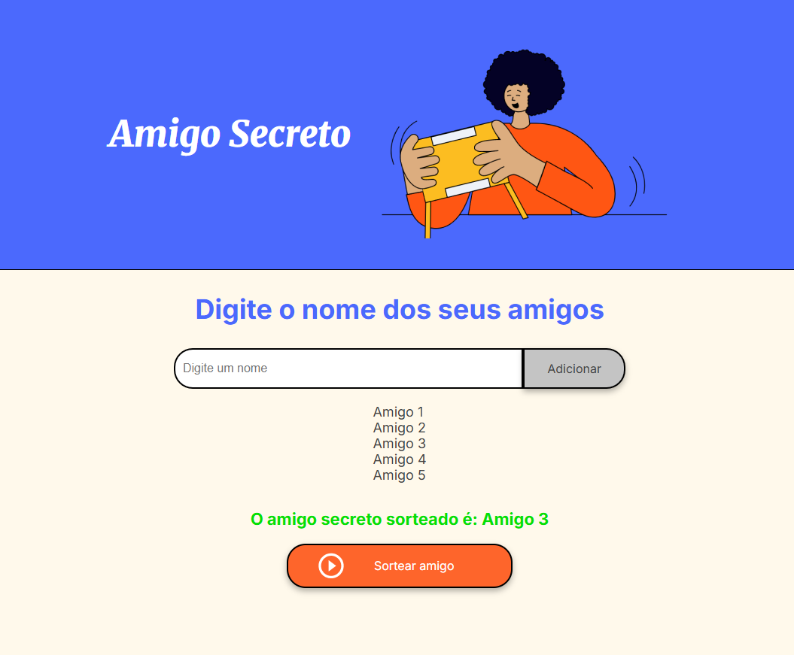

# 🎁 Projeto Amigo Secreto

Este é um projeto simples feito com **HTML**, **CSS** e **JavaScript**, que permite adicionar nomes de amigos e realizar um sorteio aleatório para descobrir quem será o amigo secreto.

## 💡 Funcionalidades

- ✅ Adicionar nomes de amigos  
- ✅ Exibir lista de amigos adicionados  
- ✅ Sortear aleatoriamente um amigo secreto  
- ✅ Feedback de validação (como campos vazios ou poucos nomes)

## 📷 Preview





## 🚀 Como usar

1. **Clone o repositório:**

   ```bash
   git clone https://github.com/seu-usuario/amigo-secreto.git
   ```

2. **Abra o arquivo `index.html` no navegador:**

   Você pode apenas clicar duas vezes no arquivo ou usar uma extensão de servidor local (como Live Server no VS Code).

3. **Digite os nomes e clique em "Adicionar".**  
4. **Quando estiver pronto, clique em "Sortear amigo".**

## 📁 Estrutura do Projeto

```
amigo-secreto/
├── index.html         # Estrutura principal da página
├── style.css          # Estilos e layout
├── app.js             # Lógica de funcionamento
└── assets/            # Imagens utilizadas no projeto
```

## 🛠 Tecnologias

- HTML5  
- CSS3 (com fontes do Google Fonts)  
- JavaScript Vanilla

## 📌 Requisitos

Nenhuma instalação necessária — apenas um navegador moderno.

## 🧠 Aprendizados

Esse projeto é ótimo para praticar:

- Manipulação do DOM com JavaScript  
- Funções, arrays e eventos  
- Boas práticas de UX com validações simples

## ✨ Contribuição

Sinta-se à vontade para abrir issues ou enviar PRs com melhorias, sugestões ou correções!

## 📝 Licença

Este projeto está sob a licença MIT.

---
